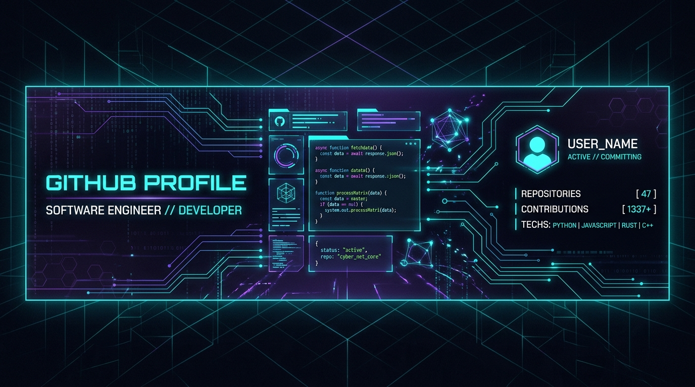

# 👋 Hello World! I'm idkwhyamihere772

  

  

---

### 🚀 About Me

I am a passionate software engineer and creative developer who loves building interactive web applications, games, and writing clean, efficient code. 

- 🔭 I’m currently working on web applications and game development.
- 🌱 I’m currently expanding my knowledge in system design, advanced algorithms, and cybersecurity.
- 🛡️ **Cybersecurity Interests**: Deeply interested in networking, bug bounty hunting, and analyzing JavaScript codebases/web pages for security vulnerabilities.
- 💬 Ask me about: **C++, Python, JavaScript, CSS, and UI/UX design**.
- ⚡ Fun fact: "In the soul of a warrior, there is no room for doubt."

---

### 🛠️ Tech Stack & Tools

  <!-- Languages -->
  
  
  
  
  

  <!-- Security & Networking -->
  
  
  
  

  <!-- Tools & OS -->
  
  
  
  

---

### 📊 GitHub Activity & Stats

  
  

  

---

### 🤝 Connect with Me

  

 

  <i>"The heart is a hollow place, but it is also where the light shines brightest."</i>

